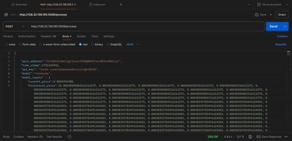

# Crypto RL Trader

This project implements a reinforcement learning agent for trading in the Solana meme coin market. The agent learns optimal trading strategies by interacting with a simulated market environment and historical DEX data.


## Getting Started
1. Install dependencies: `pip install -r requirements.txt`
2. Put data in the following file structure:

```
data/
├── raw/
│   ├── pairs/
│   │   ├── pairs_{date}.csv
│   ├── trasactions/
│   │   ├── transactions_{date}_{timestamp}.csv
├── processed/
├── ...
```

3. Preprocess the raw data to get training set: `python src/data_preprocessing/process_data.py`
4. Run the minimum implementation of supervised-learning training: `python main.py`

## Backtest Panel

We provide a web-based interactive backtest panel at [Backtest Panel](http://128.32.156.165:5000), which allows users to visualize the performance of the reinforcement learning agent under historical market conditions. This tool helps users analyze the effectiveness of the agent's trading strategies and compare them to baseline strategies.

### Features
- **Historical Price Chart**: View the historical price chart of the selected memecoin pair.
- **Prediction Confidence Insights**: View the model's confidence scores for bullish or bearish trends in real-time.


## Memecoin Price Prediction API

We deployed our model as the Memecoin Price Prediction API, which allows users to process market input data and receive a float confidence score between 0 and 1, representing the likelihood of a bullish price trend. This API is designed to integrate seamlessly with trading systems for real-time decision-making.



### API Overview

- **Title**: Memecoin Price Prediction API
- **Version**: 1.0.0
- **Description**: Processes memecoin market input data and returns a float confidence score.
- **Base URL**: [http://128.32.156.165:5006/process](http://128.32.156.165:5006/process)

### Endpoint: `/process`

**Method**: `POST`  
**Description**: Accepts a JSON payload with market input data and returns a float confidence score.

#### Request Structure

**Headers**:
- `Content-Type`: `application/json`

**Body for Sample Request** (JSON):
```json
{
    "pair_address":"3CrQVGZdjWvXjgCfzearV5hBQWhRfCqnoBE4LHNAkiyC",
    "time_stamp":1726324942,
    "api_key": "handi-yuumismokeweedeverynight@420",
    "model":"handsome-light",
    "model_inputs" : {
        "current_price":0.0003296988,
        "historical_price":[0.00038505003216212275, 0.00038505003216212275, 0.00038505003216212275, 0.00038505003216212275, 0.00038505003216212275, 0.00038505003216212275, 0.00038505003216212275, 0.00038505003216212275, 0.00038505003216212275, 0.00038505003216212275, 0.00038505003216212275, 0.00038505003216212275, 0.00038505003216212275, 0.00038505003216212275, 0.00038505003216212275, 0.00038505003216212275, 0.00038505003216212275, 0.00038505003216212275, 0.00038505003216212275, 0.00038505003216212275, 0.00038505003216212275, 0.00038505003216212275, 0.00038505003216212275, 0.00038505003216212275, 0.00038505003216212275, 0.00038505003216212275, 0.00038505003216212275, 0.00038355783491424503, 0.00038355783491424503, 0.00038355783491424503, 0.00038355783491424503, 0.00038355783491424503, 0.00038355783491424503, 0.00038355783491424503, 0.00038355783491424503, 0.00038355783491424503, 0.00038355783491424503, 0.00038355783491424503, 0.00038355783491424503, 0.00038355783491424503, 0.00038355783491424503, 0.00038355783491424503, 0.00038355783491424503, 0.00038355783491424503, 0.00038355783491424503, 0.00038355783491424503, 0.00038355783491424503, 0.00038355783491424503, 0.00038355783491424503, 0.00038355783491424503, 0.00038355783491424503, 0.00038355783491424503, 0.00038355783491424503, 0.00038355783491424503, 0.00038355783491424503, 0.00038355783491424503, 0.00038355783491424503, 0.00038355783491424503, 0.00038355783491424503, 0.00038355783491424503, 0.00038355783491424503, 0.00038355783491424503, 0.00038355783491424503, 0.00038355783491424503, 0.00038355783491424503, 0.00038355783491424503, 0.00038355783491424503, 0.00038355783491424503, 0.00038355783491424503, 0.00038355783491424503, 0.00038355783491424503, 0.00038355783491424503, 0.00038355783491424503, 0.00038355783491424503, 0.00038355783491424503, 0.00038355783491424503, 0.00038355783491424503, 0.00038355783491424503, 0.00038355783491424503, 0.00038355783491424503, 0.00038355783491424503, 0.00038355783491424503, 0.00038355783491424503, 0.00038355783491424503, 0.00038355783491424503, 0.00037860627206205266, 0.00037860627206205266, 0.00037860627206205266, 0.00037860627206205266, 0.00037860627206205266, 0.00037860627206205266, 0.00037860627206205266, 0.00037860627206205266, 0.00037860627206205266, 0.00037860627206205266, 0.00037860627206205266, 0.00037860627206205266, 0.00037860627206205266, 0.00037860627206205266, 0.00037860627206205266, 0.00037860627206205266, 0.00037860627206205266, 0.00037860627206205266, 0.00037860627206205266, 0.00037860627206205266, 0.00037860627206205266, 0.00037860627206205266, 0.00037879553508300245, 0.00037879553508300245, 0.00037879553508300245, 0.00037879553508300245, 0.00037879553508300245, 0.00037879553508300245, 0.00037879553508300245, 0.00037879553508300245, 0.00037879553508300245, 0.00037879553508300245, 0.00037879553508300245, 0.00037879553508300245, 0.00037879553508300245, 0.00037879553508300245, 0.00037879553508300245, 0.00037879553508300245, 0.00037879553508300245, 0.00037879553508300245, 0.00037879553508300245, 0.00037879553508300245, 0.00037879553508300245, 0.00037879553508300245, 0.00037879553508300245, 0.00037879553508300245, 0.00037879553508300245, 0.00037879553508300245, 0.00037879553508300245, 0.00037879553508300245, 0.00037879553508300245, 0.00037879553508300245, 0.00037879553508300245, 0.00037879553508300245, 0.00037879553508300245, 0.00037879553508300245, 0.00037879553508300245, 0.00037879553508300245, 0.00037879553508300245, 0.00037879553508300245, 0.00037879553508300245, 0.00037879553508300245, 0.00037879553508300245, 0.00037879553508300245, 0.00037879553508300245, 0.00037879553508300245, 0.00037879553508300245, 0.00037879553508300245, 0.00037879553508300245, 0.00037879553508300245, 0.00037879553508300245, 0.00037879553508300245, 0.00037879553508300245, 0.00037879553508300245, 0.00037879553508300245, 0.00037879553508300245, 0.00037879553508300245, 0.00037879553508300245, 0.00037879553508300245, 0.00037879553508300245, 0.00037879553508300245, 0.00037879553508300245, 0.00037879553508300245, 0.00037879553508300245, 0.00037879553508300245, 0.00037879553508300245, 0.00037879553508300245, 0.00037879553508300245, 0.00037879553508300245, 0.00037879553508300245, 0.00037879553508300245, 0.00037879553508300245, 0.00037879553508300245, 0.00037879553508300245, 0.00037879553508300245, 0.00037879553508300245, 0.00037879553508300245, 0.00037879553508300245, 0.00037879553508300245, 0.00037879553508300245, 0.00037879553508300245, 0.00037879553508300245, 0.00037879553508300245, 0.00037879553508300245, 0.00037879553508300245, 0.00037879553508300245, 0.00037879553508300245, 0.00037879553508300245, 0.00037879553508300245, 0.00037879553508300245, 0.00037879553508300245, 0.00037879553508300245, 0.00037879553508300245, 0.00037879553508300245, 0.00037879553508300245, 0.00037879553508300245, 0.00037879553508300245, 0.00037879553508300245, 0.00037879553508300245, 0.00037879553508300245, 0.00037879553508300245, 0.00037879553508300245, 0.00037879553508300245, 0.00037879553508300245, 0.00037879553508300245, 0.00037879553508300245, 0.00037879553508300245, 0.00037879553508300245, 0.00037879553508300245, 0.00037879553508300245, 0.00037879553508300245, 0.00037879553508300245, 0.00037879553508300245, 0.00037879553508300245, 0.00037879553508300245, 0.00037879553508300245, 0.00037879553508300245, 0.00037879553508300245, 0.00037879553508300245, 0.00037879553508300245, 0.00037879553508300245, 0.00037879553508300245, 0.00037879553508300245, 0.00037879553508300245, 0.00037879553508300245, 0.00037879553508300245, 0.00037879553508300245, 0.00037879553508300245, 0.00037879553508300245, 0.00037879553508300245, 0.00037879553508300245, 0.00037879553508300245, 0.00037879553508300245, 0.00037879553508300245, 0.00037879553508300245, 0.00037879553508300245, 0.00037879553508300245, 0.00037879553508300245, 0.00037879553508300245, 0.00037879553508300245, 0.00037879553508300245, 0.00037879553508300245, 0.00037879553508300245, 0.00037879553508300245, 0.00037879553508300245, 0.00037879553508300245, 0.00037879553508300245, 0.00037879553508300245, 0.00037879553508300245, 0.00037879553508300245, 0.00037879553508300245, 0.00037879553508300245, 0.00037879553508300245, 0.00037879553508300245, 0.00038116328810963745, 0.00038116328810963745, 0.00038116328810963745, 0.00038116328810963745, 0.00038116328810963745, 0.00038116328810963745, 0.00038116328810963745, 0.00038116328810963745, 0.00038116328810963745, 0.00038116328810963745, 0.00038116328810963745, 0.00038116328810963745, 0.00038116328810963745, 0.00038116328810963745, 0.00038116328810963745, 0.0003800538105001409, 0.0003800538105001409, 0.0003800538105001409, 0.0003800538105001409, 0.0003800538105001409, 0.0003800538105001409, 0.0003800538105001409, 0.0003800538105001409, 0.0003800538105001409, 0.0003800538105001409, 0.0003800538105001409, 0.0003800538105001409, 0.0003800538105001409, 0.0003800538105001409, 0.0003800538105001409, 0.0003800538105001409, 0.0003800538105001409, 0.0003800538105001409, 0.0003800538105001409, 0.0003800538105001409, 0.0003800538105001409, 0.0003800538105001409, 0.0003800538105001409, 0.0003800538105001409, 0.0003800538105001409, 0.0003800538105001409, 0.0003800538105001409, 0.0003800538105001409, 0.0003800538105001409, 0.0003800538105001409, 0.0003800538105001409, 0.00037923784267961314, 0.00037923784267961314, 0.00037923784267961314, 0.00037923784267961314, 0.00037923784267961314, 0.00037923784267961314, 0.00037923784267961314, 0.00037923784267961314, 0.00037923784267961314, 0.00037923784267961314, 0.00037923784267961314, 0.00037923784267961314, 0.00037923784267961314, 0.00037923784267961314, 0.00037923784267961314, 0.00037923784267961314, 0.00037923784267961314, 0.00037923784267961314, 0.00037923784267961314, 0.00037923784267961314, 0.00037923784267961314, 0.00037923784267961314, 0.00037923784267961314, 0.00037923784267961314, 0.00037923784267961314, 0.00037923784267961314, 0.00037923784267961314, 0.00037923784267961314, 0.00037923784267961314, 0.00037923784267961314, 0.00037923784267961314, 0.00037923784267961314, 0.00037923784267961314, 0.00037923784267961314, 0.00037923784267961314, 0.00037923784267961314, 0.00037923784267961314, 0.00037923784267961314, 0.00037923784267961314, 0.00037923784267961314, 0.00037923784267961314, 0.00037923784267961314, 0.00037923784267961314, 0.00037923784267961314, 0.00037923784267961314, 0.00037923784267961314, 0.00037923784267961314, 0.00037923784267961314, 0.00037923784267961314, 0.00037923784267961314, 0.00037923784267961314, 0.00037923784267961314, 0.00037923784267961314, 0.0003784667182901297, 0.0003796708302827605, 0.0003796708302827605, 0.0003796708302827605, 0.0003796708302827605, 0.0003796708302827605, 0.0003796708302827605, 0.0003796708302827605, 0.0003796708302827605, 0.0003796708302827605, 0.0003796708302827605, 0.0003796708302827605, 0.0003796708302827605, 0.0003796708302827605, 0.0003796708302827605, 0.0003796708302827605, 0.0003796708302827605, 0.0003796708302827605, 0.0003796708302827605, 0.0003796708302827605, 0.0003796708302827605, 0.0003796708302827605, 0.0003796708302827605, 0.0003796708302827605, 0.0003796708302827605, 0.0003796708302827605, 0.0003796708302827605, 0.0003796708302827605, 0.0003796708302827605, 0.0003796708302827605, 0.0003796708302827605, 0.0003796708302827605, 0.0003796708302827605, 0.0003796708302827605, 0.0003796708302827605, 0.00037732098925477456, 0.00037732098925477456, 0.00037732098925477456, 0.00037732098925477456, 0.00037732098925477456, 0.00037732098925477456, 0.00037732098925477456, 0.00037732098925477456, 0.00037732098925477456, 0.00037732098925477456, 0.00037732098925477456, 0.00037732098925477456, 0.00037732098925477456, 0.00037732098925477456, 0.00037732098925477456, 0.00037732098925477456, 0.00037732098925477456, 0.00037732098925477456, 0.00037732098925477456, 0.00037732098925477456, 0.00037732098925477456, 0.00037732098925477456, 0.00037732098925477456, 0.00037732098925477456, 0.00037732098925477456, 0.00037732098925477456, 0.00037732098925477456, 0.00037732098925477456, 0.00037732098925477456, 0.00037732098925477456, 0.00037732098925477456, 0.00037732098925477456, 0.00037732098925477456, 0.00037732098925477456, 0.00037732098925477456, 0.00037732098925477456, 0.00037732098925477456, 0.00037732098925477456, 0.00037732098925477456, 0.00037732098925477456, 0.00037732098925477456, 0.00037732098925477456, 0.00037732098925477456, 0.00037732098925477456, 0.00037732098925477456, 0.00037732098925477456, 0.00037732098925477456, 0.00037732098925477456, 0.00037732098925477456, 0.00037732098925477456, 0.00037732098925477456, 0.00037732098925477456, 0.00037732098925477456, 0.00037732098925477456, 0.00037732098925477456, 0.00037732098925477456, 0.00037732098925477456, 0.00037732098925477456, 0.00037732098925477456, 0.00037732098925477456, 0.00037732098925477456, 0.00037732098925477456, 0.00037732098925477456, 0.00037732098925477456, 0.00037732098925477456, 0.00037732098925477456, 0.00037732098925477456, 0.00037732098925477456, 0.0003746493292626288, 0.0003746493292626288, 0.0003746493292626288, 0.0003746493292626288, 0.00037464525520886153, 0.00037464525520886153, 0.00037464525520886153, 0.00037464525520886153, 0.00037464525520886153, 0.00037464525520886153, 0.00037464525520886153, 0.00037464525520886153, 0.00037464525520886153, 0.00037464525520886153, 0.00037464525520886153, 0.00037464525520886153, 0.0003701119402937429, 0.00036937362761537107, 0.00037020435877353563, 0.00037020435877353563, 0.00037020435877353563, 0.00037136625053009253, 0.0003747198825602653, 0.0003747198825602653, 0.0003772085912523751, 0.0003772085912523751, 0.0003772085912523751, 0.0003772085912523751, 0.0003772085912523751, 0.0003772085912523751, 0.0003772085912523751, 0.0003772085912523751, 0.0003772085912523751, 0.0003772085912523751, 0.0003772085912523751, 0.0003772085912523751, 0.0003772085912523751, 0.0003772085912523751, 0.0003772085912523751, 0.0003772085912523751, 0.0003772085912523751, 0.0003772085912523751, 0.0003772085912523751, 0.0003772085912523751, 0.0003772085912523751, 0.0003772085912523751, 0.0003772085912523751, 0.0003772085912523751, 0.0003772085912523751, 0.0003772085912523751, 0.0003772085912523751, 0.0003772085912523751, 0.0003772085912523751, 0.0003772085912523751, 0.0003772085912523751, 0.0003772085912523751, 0.0003772085912523751, 0.0003772085912523751, 0.0003772085912523751, 0.0003772085912523751, 0.0003772085912523751, 0.0003772085912523751, 0.0003772085912523751, 0.0003772085912523751, 0.0003772085912523751, 0.0003772085912523751, 0.0003772085912523751, 0.0003772085912523751, 0.0003772085912523751, 0.0003772085912523751, 0.0003772085912523751, 0.0003772085912523751, 0.0003772085912523751, 0.0003772085912523751, 0.0003772085912523751, 0.0003772085912523751, 0.0003772085912523751, 0.0003772085912523751, 0.0003772085912523751, 0.0003772085912523751, 0.0003772085912523751, 0.0003772085912523751, 0.0003772085912523751, 0.0003772085912523751, 0.0003772085912523751, 0.0003772085912523751, 0.0003772085912523751, 0.0003772085912523751, 0.0003772085912523751, 0.0003772085912523751, 0.0003772085912523751, 0.0003772085912523751, 0.0003772085912523751, 0.0003772085912523751, 0.0003772085912523751, 0.0003772085912523751, 0.0003772085912523751, 0.0003772085912523751, 0.0003772085912523751, 0.0003772085912523751, 0.0003772085912523751, 0.0003772085912523751, 0.0003772085912523751, 0.0003772085912523751, 0.0003772085912523751, 0.0003772085912523751, 0.00037878696285244436, 0.00037878696285244436, 0.00037878696285244436, 0.00037878696285244436, 0.00037878696285244436, 0.00037878696285244436, 0.00037878696285244436, 0.00037878696285244436, 0.00037878696285244436, 0.00037878696285244436, 0.00037878696285244436, 0.00037878696285244436, 0.00037878696285244436, 0.00037878696285244436, 0.00037878696285244436, 0.00037878696285244436, 0.00037878696285244436, 0.00037878696285244436, 0.00037878696285244436, 0.00037878696285244436, 0.00038027563714982825, 0.00038027563714982825, 0.00038027563714982825, 0.00038027563714982825, 0.00038027563714982825, 0.00038027563714982825, 0.00038027563714982825, 0.00038027563714982825, 0.00038027563714982825, 0.00038027563714982825, 0.00038027563714982825, 0.00038027563714982825, 0.00038027563714982825, 0.00038027563714982825, 0.00038027563714982825, 0.00038350775662758334, 0.00038350775662758334, 0.00038350775662758334, 0.00038350775662758334, 0.00038350775662758334, 0.00038350775662758334, 0.00038350775662758334, 0.00038350775662758334, 0.00038350775662758334, 0.00038350775662758334, 0.00038350775662758334, 0.00038350775662758334, 0.00038350775662758334, 0.00038350775662758334, 0.00038350775662758334, 0.00038350775662758334, 0.00038350775662758334, 0.00038350775662758334, 0.00038350775662758334, 0.00038350775662758334, 0.00038350775662758334, 0.00038350775662758334, 0.00038350775662758334, 0.00038350775662758334, 0.00038350775662758334, 0.00038350775662758334, 0.00038350775662758334, 0.00038365673061644144, 0.00038365673061644144, 0.00038365673061644144, 0.00038365673061644144, 0.00038365673061644144, 0.00038365673061644144, 0.00038365673061644144, 0.00038365673061644144, 0.00038365673061644144, 0.00038365673061644144, 0.00038365673061644144, 0.00038365673061644144, 0.00038365673061644144, 0.00038365673061644144, 0.00038365673061644144, 0.00038365673061644144, 0.00038365673061644144, 0.00038365673061644144, 0.00038365673061644144, 0.00038365673061644144, 0.00038365673061644144, 0.00038365673061644144, 0.00038365673061644144, 0.00038365673061644144, 0.00038365673061644144, 0.00038365673061644144, 0.00038365673061644144, 0.00038365673061644144, 0.00038365673061644144, 0.00038365673061644144, 0.00038365673061644144, 0.00038326535260386693, 0.00038326535260386693, 0.00038326535260386693, 0.00038326535260386693, 0.00038326535260386693, 0.00038326535260386693, 0.00038326535260386693, 0.00038326535260386693, 0.00038326535260386693, 0.00038326535260386693, 0.00038326535260386693, 0.00038326535260386693, 0.00038326535260386693, 0.00038326535260386693, 0.00038326535260386693, 0.00038326535260386693, 0.00038326535260386693, 0.00038326535260386693, 0.00038326535260386693, 0.00038326535260386693, 0.00038326535260386693, 0.00038326535260386693, 0.00038326535260386693, 0.00038326535260386693, 0.00038326535260386693, 0.00038326535260386693, 0.00038326535260386693, 0.00038326535260386693, 0.00038326535260386693, 0.00038326535260386693, 0.00038326535260386693, 0.00038326535260386693, 0.00038326535260386693, 0.00038326535260386693, 0.00038326535260386693, 0.00038326535260386693, 0.00038326535260386693, 0.00038326535260386693, 0.00038326535260386693, 0.00038326535260386693, 0.00038326535260386693, 0.00038326535260386693, 0.00038326535260386693, 0.00038326535260386693, 0.00038326535260386693, 0.00038326535260386693, 0.00038326535260386693, 0.00038326535260386693, 0.00032947598988691736, 0.00033833804688178284, 0.00034079011257558443, 0.0003423074061184347, 0.00034303083982422343, 0.00034513138817220996, 0.0003468041659764946, 0.0003513783985912076, 0.0003513783985912076, 0.00034686999584831855, 0.00034530590951958873, 0.00034530590951958873, 0.00034530590951958873, 0.00034530590951958873, 0.0003392122383786027, 0.0003392122383786027, 0.0003392122383786027, 0.0003392122383786027, 0.0003380589888114737, 0.0003380589888114737, 0.0003380589888114737, 0.0003380589888114737, 0.0003380589888114737, 0.00029177049910912226, 0.00030027468862972557, 0.0002984916230441624, 0.00029856400527993385, 0.00029685548819325693, 0.0002987959603853375, 0.0002979720870114532, 0.00030124023175208354, 0.00029605682806157466, 0.0002993273938903226, 0.0002993273938903226, 0.00030036836458775237, 0.0003011144669920637, 0.0003011144669920637, 0.000301733907287472, 0.000301733907287472, 0.000301733907287472, 0.000301733907287472, 0.000301733907287472, 0.00030445381969843185, 0.00030445381969843185, 0.00030445381969843185, 0.00030445381969843185, 0.00030445381969843185, 0.00030445381969843185, 0.00030445381969843185, 0.00030445381969843185, 0.00030445381969843185, 0.00029755987885563863, 0.00029966837696271604, 0.0003060944765000635, 0.0003060944765000635, 0.0003060944765000635, 0.0003060944765000635, 0.0003060944765000635, 0.0003060944765000635, 0.0003060944765000635, 0.00030829710720349995, 0.0003039847583053109, 0.0003039847583053109, 0.0003039847583053109, 0.0003039847583053109, 0.0003039847583053109, 0.0003039847583053109, 0.0003039847583053109, 0.0003039847583053109, 0.0003039847583053109, 0.0003039847583053109, 0.0003039847583053109, 0.0003039847583053109, 0.0003039847583053109, 0.0003039847583053109, 0.0003039847583053109, 0.0003054118523620045, 0.0003054118523620045, 0.0003054118523620045, 0.00030644801374982904, 0.00030644801374982904, 0.00030644801374982904, 0.00030644801374982904, 0.00030644801374982904, 0.00030644801374982904, 0.00030644801374982904, 0.00030644801374982904, 0.00030644801374982904, 0.00030644801374982904, 0.00030644801374982904, 0.00030644801374982904, 0.00030644801374982904, 0.00030644801374982904, 0.00030644801374982904, 0.00030644801374982904, 0.00030644801374982904, 0.0003077842028537797, 0.0003077842028537797, 0.0003077842028537797, 0.0003077842028537797, 0.0003077842028537797, 0.0003088698817730866, 0.0003088698817730866, 0.0003105151001428815, 0.00031102761164753765, 0.00031102761164753765, 0.00031102761164753765, 0.0003021934137135458, 0.00029582901158432205, 0.00029582901158432205, 0.00029582901158432205, 0.00029582901158432205, 0.00029628227464382844, 0.00029628227464382844, 0.00029628227464382844, 0.00029628227464382844, 0.00029628227464382844, 0.00029628227464382844, 0.00029628227464382844, 0.00029874928145304756, 0.00029874928145304756, 0.00029874928145304756, 0.000300582148273137, 0.000300582148273137, 0.000300582148273137, 0.000300582148273137, 0.000300582148273137, 0.000300582148273137, 0.000300582148273137, 0.000300582148273137, 0.000300582148273137, 0.000300582148273137, 0.000300582148273137, 0.00030264515084867094, 0.00030264515084867094, 0.00030264515084867094, 0.00030264515084867094, 0.00030264515084867094, 0.00030264515084867094, 0.00030506739240760723, 0.00030506739240760723, 0.00030506739240760723, 0.00030506739240760723, 0.00030506739240760723, 0.00030506739240760723, 0.00030506739240760723, 0.00030506739240760723, 0.00030506739240760723, 0.00030506739240760723, 0.00030506739240760723, 0.00030506739240760723, 0.00030506739240760723, 0.00030506739240760723, 0.00030506739240760723, 0.00030506739240760723, 0.00030506739240760723, 0.00030506739240760723, 0.0003046282151874493, 0.0003046282151874493, 0.0003046282151874493, 0.0003046282151874493, 0.0003046282151874493, 0.0003035148790664299, 0.0003035148790664299, 0.0003035148790664299, 0.0003035148790664299, 0.00030469186944044455, 0.00030469186944044455, 0.00030179926127634003, 0.00030179926127634003, 0.00029898064843221977, 0.0003008941449567068, 0.0003056626074693514, 0.0003056626074693514, 0.0003056626074693514, 0.0003056626074693514, 0.0003056626074693514, 0.0003056626074693514, 0.0003056626074693514, 0.0003056626074693514, 0.0003056626074693514, 0.0003056626074693514, 0.0003056626074693514, 0.0003056626074693514, 0.0003056626074693514, 0.0003056626074693514, 0.0003056626074693514, 0.0003056626074693514, 0.0003056626074693514, 0.0003056626074693514, 0.0003056626074693514, 0.0003056626074693514, 0.0003056626074693514, 0.0003056626074693514, 0.0003056626074693514, 0.0003056626074693514, 0.00030650030237238226, 0.00030650030237238226, 0.00030688609509120805, 0.0003076660345644376, 0.00030864720301651354, 0.0003097679933222219, 0.0003097679933222219, 0.0003097679933222219, 0.0003097679933222219, 0.0003097679933222219, 0.0003097679933222219, 0.0003097679933222219, 0.0003116808244753752, 0.00031142119887332, 0.00031142119887332, 0.00031142119887332, 0.00031142119887332, 0.00031142119887332, 0.00031142119887332, 0.00031142119887332, 0.0003164534471808655, 0.00031443199861353057, 0.00031443199861353057, 0.00031443199861353057, 0.000313964072369048, 0.000313964072369048, 0.000313964072369048, 0.000313964072369048, 0.000313964072369048, 0.000313964072369048, 0.000313964072369048, 0.000313964072369048, 0.00031317922495354035, 0.00031317922495354035, 0.0003188655911258814, 0.0003188655911258814, 0.0003188655911258814, 0.0003188655911258814, 0.0003188655911258814, 0.0003188655911258814, 0.0003188655911258814, 0.0003188655911258814, 0.0003188655911258814, 0.0003188655911258814, 0.0003185436443250663, 0.0003185436443250663, 0.00031939921457423256, 0.00031939921457423256, 0.00031939921457423256, 0.00031939921457423256, 0.00031939921457423256, 0.00031939921457423256, 0.00031939921457423256, 0.00031939921457423256, 0.00031939921457423256, 0.00031939921457423256, 0.00031939921457423256, 0.0003164005044009658, 0.0003164005044009658, 0.0003164005044009658, 0.000316263648599462, 0.000316263648599462, 0.00031801234191239136, 0.0003197807247679459, 0.0003197807247679459, 0.00032120740732763733, 0.00032249483686886326, 0.00032249483686886326, 0.00032249483686886326, 0.00032084994506054957, 0.00032084994506054957, 0.000319975860418773, 0.000319975860418773, 0.000319975860418773, 0.000319975860418773, 0.000319975860418773, 0.000319975860418773, 0.000319975860418773, 0.000319975860418773, 0.0003184114922945469, 0.0003184114922945469, 0.0003166978580309326, 0.0003166978580309326, 0.0003263015698522791, 0.0003263015698522791, 0.0003263015698522791, 0.0003263015698522791, 0.0003275494219571254, 0.0003275494219571254, 0.0003275494219571254, 0.0003275494219571254, 0.0003275494219571254, 0.0003275494219571254, 0.0003275494219571254, 0.0003275494219571254, 0.0003275494219571254, 0.0003275494219571254, 0.0003275494219571254, 0.0003275494219571254, 0.0003275494219571254, 0.0003275494219571254, 0.0003275494219571254, 0.0003275494219571254, 0.0003275494219571254, 0.0003252649717286586, 0.0003252649717286586, 0.0003252649717286586, 0.0003252649717286586, 0.0003252649717286586, 0.0003252649717286586, 0.0003291640315562017, 0.0003291640315562017, 0.0003291640315562017, 0.0003291640315562017, 0.0003291640315562017, 0.0003291640315562017, 0.0003291640315562017, 0.0003291640315562017, 0.0003291640315562017, 0.00032953472577992854, 0.00032953472577992854, 0.00032953472577992854, 0.00032953472577992854, 0.00032953472577992854, 0.00032953472577992854, 0.00032953472577992854, 0.00032953472577992854, 0.00032953472577992854, 0.00033158933218337637, 0.00033158933218337637, 0.00033158933218337637, 0.00033158933218337637, 0.00033158933218337637, 0.00033158933218337637, 0.00033158933218337637, 0.00033158933218337637, 0.00033158933218337637, 0.00033158933218337637, 0.000331939751625027, 0.00033128829004884774, 0.00033128829004884774, 0.00033128829004884774, 0.00033128829004884774, 0.00033128829004884774, 0.00033128829004884774, 0.00033128829004884774, 0.00033128829004884774, 0.00033128829004884774, 0.00033128829004884774, 0.00033128829004884774, 0.00033128829004884774, 0.00033128829004884774, 0.00033128829004884774, 0.00033313866709957656, 0.00033313866709957656, 0.00033313866709957656, 0.00033313866709957656, 0.00033313866709957656, 0.00033313866709957656, 0.00033313866709957656, 0.00033313866709957656, 0.00033313866709957656, 0.00033313866709957656, 0.00033313866709957656, 0.00033313866709957656, 0.00033313866709957656, 0.00033313866709957656, 0.00033313866709957656, 0.00033313866709957656, 0.00033313866709957656, 0.00033313866709957656, 0.00033414988034888553, 0.00033414988034888553, 0.00033414988034888553, 0.00033414988034888553, 0.0003329030346646941, 0.0003329030346646941, 0.0003329030346646941, 0.0003329030346646941, 0.0003329030346646941, 0.0003329030346646941, 0.0003329030346646941, 0.0003329030346646941, 0.0003329030346646941, 0.0003329030346646941, 0.0003329030346646941, 0.0003329030346646941, 0.0003329030346646941, 0.0003329030346646941, 0.0003329030346646941, 0.0003329030346646941, 0.0003329030346646941, 0.0003329030346646941, 0.0003329030346646941, 0.0003329030346646941, 0.0003329030346646941, 0.0003329030346646941, 0.0003329030346646941, 0.00033004161863176327, 0.00033004161863176327, 0.00033004161863176327, 0.00033004161863176327, 0.00033004161863176327, 0.00032631925324265015, 0.00032631925324265015, 0.00032631925324265015, 0.00032631925324265015, 0.0003280105269655433, 0.0003260037196634223, 0.0003260037196634223, 0.0003260037196634223, 0.000327375301226656, 0.0003249107870897693, 0.0003249107870897693, 0.0003249107870897693, 0.0003249107870897693, 0.00032540241154347153, 0.00032540241154347153, 0.00032540241154347153, 0.00032540241154347153, 0.000326046807406433, 0.000326046807406433, 0.000326046807406433, 0.000326046807406433, 0.000326046807406433, 0.000326046807406433, 0.000326046807406433, 0.000326046807406433, 0.000326046807406433, 0.000326046807406433, 0.000326046807406433, 0.000326046807406433, 0.000326046807406433, 0.000326046807406433, 0.000326046807406433, 0.000326046807406433, 0.000326046807406433, 0.000326046807406433, 0.000326046807406433, 0.000326046807406433, 0.00033027151838591317, 0.00033027151838591317, 0.00033027151838591317, 0.00033027151838591317, 0.00033027151838591317, 0.00033027151838591317, 0.00033027151838591317, 0.00033027151838591317, 0.00033027151838591317, 0.00033027151838591317, 0.00032843585364704473, 0.00032843585364704473, 0.00032625481865196626, 0.00032625481865196626, 0.00032625481865196626, 0.00032687974073554053, 0.0003277887972619069, 0.0003277887972619069, 0.0003277887972619069, 0.0003277887972619069, 0.0003277887972619069, 0.0003277887972619069, 0.0003277887972619069, 0.0003277887972619069, 0.0003277887972619069, 0.0003303296492380534, 0.0003303296492380534, 0.0003303296492380534, 0.0003303296492380534, 0.0003303296492380534, 0.0003303296492380534, 0.0003303296492380534, 0.0003303296492380534, 0.0003303296492380534, 0.0003300993356148327, 0.0003300993356148327, 0.00033007857445900286, 0.00033007857445900286, 0.00033007857445900286, 0.0003284364425771078, 0.0003284364425771078, 0.0003284364425771078, 0.0003284364425771078, 0.0003284364425771078, 0.0003284364425771078, 0.0003284364425771078, 0.0003284364425771078, 0.0003284364425771078, 0.0003284364425771078, 0.0003284364425771078, 0.0003284364425771078, 0.0003284364425771078, 0.0003284364425771078, 0.0003284364425771078, 0.0003284364425771078, 0.0003284364425771078, 0.0003284364425771078, 0.0003284364425771078, 0.0003284364425771078, 0.0003284364425771078, 0.0003284364425771078, 0.0003284364425771078, 0.0003284364425771078, 0.0003284364425771078, 0.00032911054322024924, 0.00032911054322024924, 0.00032911054322024924, 0.00033002388943901455, 0.00033002388943901455, 0.00033096424332330454, 0.00033096424332330454, 0.00033096424332330454, 0.00033096424332330454, 0.00033096424332330454, 0.00033096424332330454, 0.00033096424332330454, 0.00033096424332330454, 0.0003320213535056791, 0.0003320213535056791, 0.0003320213535056791, 0.0003320213535056791, 0.0003331534206829942, 0.0003331534206829942, 0.0003315239370785611, 0.0003315239370785611, 0.0003315239370785611, 0.0003315239370785611, 0.0003315239370785611, 0.0003315239370785611, 0.0003315239370785611, 0.0003315239370785611, 0.0003315239370785611, 0.0003315239370785611, 0.0003315239370785611, 0.0003315239370785611, 0.0003315239370785611, 0.0003315239370785611, 0.0003315239370785611, 0.0003315239370785611, 0.0003315239370785611, 0.000333135041703555, 0.000333135041703555, 0.000333135041703555, 0.000333135041703555, 0.000333135041703555, 0.000333135041703555, 0.000333135041703555, 0.000333135041703555, 0.000333135041703555, 0.000333135041703555, 0.000333135041703555, 0.000333135041703555, 0.000333135041703555, 0.000333135041703555, 0.000333135041703555, 0.000333135041703555, 0.000333135041703555, 0.00033522814581335555, 0.00033522814581335555, 0.00033522814581335555, 0.00033522814581335555, 0.00033522814581335555, 0.00033522814581335555, 0.00033522814581335555, 0.00033522814581335555, 0.00033522814581335555, 0.00033522814581335555, 0.00033522814581335555, 0.0003350295751430273, 0.0003350295751430273, 0.0003350295751430273, 0.0003350295751430273, 0.0003350295751430273, 0.0003350295751430273, 0.0003350295751430273, 0.0003350295751430273, 0.0003350295751430273, 0.0003350295751430273, 0.0003350295751430273, 0.0003366810113051054, 0.0003366810113051054, 0.0003366810113051054, 0.0003366810113051054, 0.0003366810113051054, 0.0003366810113051054, 0.0003366810113051054, 0.0003366810113051054, 0.0003366810113051054, 0.0003366810113051054, 0.0003366810113051054, 0.0003366810113051054, 0.0003366810113051054, 0.0003366810113051054, 0.0003366810113051054, 0.0003366810113051054, 0.0003366810113051054, 0.0003366810113051054, 0.0003366810113051054, 0.0003366810113051054, 0.0003366810113051054, 0.0003366810113051054, 0.0003366810113051054, 0.0003366810113051054, 0.0003366810113051054, 0.0003366810113051054, 0.0003366810113051054, 0.0003366810113051054, 0.0003366810113051054, 0.0003366810113051054, 0.0003366810113051054, 0.0003366810113051054, 0.0003366810113051054, 0.0003366810113051054, 0.0003366810113051054, 0.0003366810113051054, 0.0003366810113051054, 0.0003366810113051054, 0.0003366810113051054, 0.0003366810113051054, 0.0003366810113051054, 0.0003366810113051054, 0.0003366810113051054, 0.0003366810113051054, 0.0003366810113051054, 0.0003366810113051054, 0.0003366810113051054, 0.0003366810113051054, 0.0003366810113051054, 0.0003366810113051054, 0.0003366810113051054, 0.0003366810113051054, 0.00033715510899193126, 0.00033715510899193126, 0.00033715510899193126, 0.00033715510899193126, 0.00033715510899193126, 0.00033715510899193126, 0.00033715510899193126, 0.00033715510899193126, 0.00033715510899193126, 0.00033715510899193126, 0.0003309070086838068, 0.0003309070086838068, 0.0003309070086838068, 0.0003286506388624693, 0.0003286506388624693, 0.0003299893045595975, 0.000333039887846863, 0.0003328565879214259, 0.0003328565879214259, 0.0003328565879214259, 0.0003328565879214259, 0.0003328565879214259, 0.0003328565879214259, 0.000332236228076935, 0.000332236228076935, 0.0003312649698941804, 0.0003312649698941804, 0.0003312649698941804, 0.0003312649698941804, 0.0003312649698941804, 0.0003312649698941804, 0.0003312649698941804, 0.0003312649698941804, 0.0003312649698941804, 0.00033273893936343465, 0.00033273893936343465, 0.00033273893936343465, 0.00033273893936343465, 0.00033273893936343465, 0.00033372508489869164, 0.00033372508489869164, 0.00033372508489869164, 0.00033372508489869164, 0.00033223619583985786, 0.00033223619583985786, 0.00033122394234188243, 0.00033122394234188243, 0.00033122394234188243, 0.00033122394234188243, 0.0003336050679721361, 0.0003336050679721361, 0.00033386776948605295, 0.00033386776948605295, 0.00033284520147447004, 0.00033284520147447004, 0.00033284520147447004, 0.00033284520147447004, 0.00033284520147447004, 0.00033284520147447004, 0.00033284520147447004, 0.00033284520147447004, 0.0003327343610135565, 0.0003327343610135565, 0.0003327343610135565, 0.0003327343610135565, 0.0003327343610135565, 0.0003327343610135565, 0.0003327343610135565, 0.0003327343610135565, 0.0003327343610135565, 0.0003314857384633722, 0.0003314857384633722, 0.00032953416507330207, 0.00032953416507330207, 0.00032953416507330207, 0.00032953416507330207, 0.00032953416507330207, 0.00032953416507330207, 0.00032953416507330207, 0.00032953416507330207, 0.00032953416507330207, 0.00032953416507330207, 0.00032953416507330207, 0.00032953416507330207, 0.00032953416507330207, 0.00032953416507330207, 0.00032953416507330207, 0.00032953416507330207, 0.00032953416507330207, 0.00032953416507330207, 0.00032953416507330207, 0.00032953416507330207, 0.00032953416507330207, 0.00032953416507330207, 0.000328171989425264, 0.000328171989425264, 0.000328171989425264, 0.000328171989425264, 0.000328171989425264, 0.0003273798683237655, 0.0003273798683237655, 0.0003273798683237655, 0.0003273798683237655, 0.0003273798683237655, 0.0003273798683237655, 0.0003273798683237655, 0.0003273798683237655, 0.0003273798683237655, 0.0003273798683237655, 0.0003273798683237655, 0.0003273798683237655, 0.0003273798683237655, 0.0003273798683237655, 0.0003273798683237655, 0.0003273798683237655, 0.0003273798683237655, 0.0003273798683237655, 0.0003273798683237655, 0.0003273798683237655, 0.0003273798683237655, 0.0003273798683237655, 0.0003273798683237655, 0.0003273798683237655, 0.0003273798683237655, 0.0003273798683237655, 0.0003273798683237655, 0.0003273798683237655, 0.0003273798683237655, 0.0003273798683237655, 0.0003273798683237655, 0.0003273798683237655, 0.0003273798683237655, 0.0003273798683237655, 0.0003273798683237655, 0.0003273798683237655, 0.00032830262523413106, 0.00032830262523413106, 0.0003265850403331767, 0.00032592891269693584, 0.00032592891269693584, 0.00032592891269693584, 0.00032592891269693584, 0.00032592891269693584, 0.00032592891269693584, 0.00032592891269693584, 0.00032592891269693584, 0.00032592891269693584, 0.0003285846662581957, 0.0003285846662581957, 0.0003280528377723687, 0.0003274648410571948, 0.00032678477645923246, 0.00032678477645923246, 0.00032678477645923246, 0.00032678477645923246, 0.00032678477645923246, 0.00032678477645923246, 0.00032678477645923246, 0.00032678477645923246, 0.00032678477645923246, 0.00032678477645923246, 0.00032678477645923246, 0.00032678477645923246, 0.00032678477645923246, 0.00032678477645923246, 0.00032678477645923246, 0.00032678477645923246, 0.00032678477645923246, 0.00032678477645923246, 0.00032678477645923246, 0.00032602671744496323, 0.00032602671744496323, 0.00032602671744496323, 0.00032602671744496323, 0.00032602671744496323, 0.00032602671744496323, 0.00032602671744496323, 0.00032602671744496323, 0.00032602671744496323, 0.00032602671744496323, 0.00032602671744496323, 0.00032602671744496323, 0.00032602671744496323, 0.00032505436633631845, 0.00032505436633631845, 0.00032735056921543956, 0.00032735056921543956, 0.0003293265314743099, 0.0003293265314743099, 0.0003293265314743099, 0.0003293265314743099, 0.0003293265314743099, 0.0003293265314743099, 0.0003293265314743099, 0.0003279145794591341, 0.0003273347099427234, 0.0003273347099427234, 0.0003273347099427234, 0.0003273347099427234, 0.0003273347099427234, 0.0003273347099427234, 0.0003273347099427234, 0.0003273347099427234, 0.0003273347099427234, 0.0003269248443182, 0.0003269248443182, 0.0003269248443182, 0.0003269248443182, 0.0003269248443182, 0.0003269248443182, 0.0003269248443182, 0.0003269248443182, 0.0003269248443182, 0.00032656404219727687, 0.00032656404219727687, 0.00032656404219727687, 0.0003283005255771548, 0.00032683193639953634, 0.00032683193639953634, 0.00032683193639953634, 0.00032683193639953634, 0.00032683193639953634, 0.00032683193639953634, 0.00032683193639953634, 0.00032683193639953634, 0.00032683193639953634, 0.00032683193639953634, 0.00032683193639953634, 0.00032683193639953634, 0.0003264468361552902, 0.0003264468361552902, 0.0003264468361552902, 0.00032843441334301255, 0.00032843441334301255, 0.00032688610263439927, 0.00032688610263439927, 0.00032688610263439927, 0.00032688610263439927, 0.00032688610263439927, 0.00032688610263439927, 0.00032688610263439927, 0.00032688610263439927, 0.00032688610263439927, 0.00032688610263439927, 0.00032688610263439927, 0.00032688610263439927, 0.00032688610263439927, 0.00032688610263439927, 0.00032688610263439927, 0.00032688610263439927, 0.00032688610263439927, 0.00032688610263439927, 0.00032688610263439927, 0.000326363315465537, 0.000326363315465537, 0.000326363315465537, 0.0003284054301942533, 0.0003298229785225582, 0.0003298229785225582, 0.0003298229785225582, 0.0003298229785225582, 0.0003298229785225582, 0.0003298229785225582, 0.0003265671211837862, 0.0003265671211837862, 0.0003273507182282958, 0.00033059423630702654, 0.00033059423630702654, 0.00033059423630702654, 0.00033059423630702654, 0.00033059423630702654, 0.00033059423630702654, 0.00033059423630702654, 0.00033059423630702654, 0.00033059423630702654, 0.00033059423630702654, 0.00033059423630702654, 0.00033059423630702654, 0.00033059423630702654, 0.00033059423630702654, 0.00033059423630702654, 0.00033059423630702654, 0.00033059423630702654, 0.00033059423630702654, 0.00033059423630702654, 0.00033059423630702654, 0.00033059423630702654, 0.00033059423630702654, 0.00033059423630702654, 0.00033059423630702654, 0.00033059423630702654, 0.00033059423630702654, 0.00033059423630702654, 0.00033059423630702654, 0.00033059423630702654, 0.00033059423630702654, 0.00033059423630702654, 0.00033059423630702654, 0.00033059423630702654, 0.0003300072959246939, 0.0003300072959246939, 0.0003300072959246939, 0.00033211941059460077, 0.00033211941059460077, 0.00033269742542381436, 0.00033269742542381436, 0.00033269742542381436, 0.0003308535554058505, 0.0003308535554058505, 0.0003308535554058505, 0.0003308535554058505, 0.0003308535554058505, 0.0003308535554058505, 0.0003308535554058505, 0.0003308535554058505, 0.0003308535554058505, 0.0003308535554058505, 0.0003308535554058505, 0.0003306937713044312, 0.0003306937713044312, 0.0003306937713044312, 0.0003306937713044312, 0.0003306937713044312, 0.0003306937713044312, 0.0003306937713044312, 0.0003306937713044312, 0.0003306937713044312, 0.0003306937713044312, 0.0003306937713044312, 0.0003306937713044312, 0.0003306937713044312, 0.0003306937713044312, 0.0003306937713044312, 0.0003306937713044312, 0.0003306937713044312, 0.0003306937713044312, 0.0003306937713044312, 0.0003306937713044312, 0.0003306937713044312, 0.0003306937713044312, 0.0003306937713044312, 0.0003306937713044312, 0.0003306937713044312, 0.0003306937713044312, 0.0003301621815565788, 0.0003301621815565788, 0.0003301621815565788, 0.0003301621815565788, 0.00033395123449465506, 0.00033395123449465506, 0.00033395123449465506, 0.00033395123449465506, 0.00033395123449465506, 0.00033395123449465506, 0.00033395123449465506, 0.00033395123449465506, 0.00033395123449465506, 0.00033395123449465506, 0.00033395123449465506, 0.00033395123449465506, 0.00033395123449465506, 0.00033395123449465506, 0.00033395123449465506, 0.00033395123449465506, 0.00033395123449465506, 0.00033395123449465506, 0.00033395123449465506, 0.00033395123449465506, 0.00033395123449465506, 0.00033395123449465506, 0.00033395123449465506, 0.00033395123449465506, 0.00033395123449465506, 0.00033395123449465506, 0.00033395123449465506, 0.00033395123449465506, 0.00033395123449465506, 0.00033395123449465506, 0.00033395123449465506, 0.00033395123449465506, 0.00033395123449465506, 0.00033395123449465506, 0.00033395123449465506, 0.00033395431037677026, 0.00033395431037677026, 0.00033328509867880184, 0.00033328509867880184, 0.00033328509867880184, 0.00033328509867880184, 0.00033328509867880184, 0.00033328509867880184, 0.00033328509867880184, 0.00033328509867880184, 0.00033328509867880184, 0.00033328509867880184, 0.00033328509867880184, 0.00033328509867880184, 0.00033328509867880184, 0.00033328509867880184, 0.00033328509867880184, 0.00033328509867880184, 0.00033328509867880184, 0.00033312005447888897, 0.00033312005447888897, 0.00033312005447888897, 0.00033312005447888897, 0.00033312005447888897, 0.00033312005447888897, 0.00033312005447888897, 0.00033312005447888897, 0.00033312005447888897, 0.00033312005447888897, 0.00033312005447888897, 0.00033312005447888897, 0.00033312005447888897, 0.00033312005447888897, 0.00033312005447888897, 0.00033312005447888897, 0.00033312005447888897, 0.00033312005447888897, 0.00033312005447888897, 0.00033312005447888897, 0.00033312005447888897, 0.00033312005447888897, 0.00033312005447888897, 0.00033312005447888897, 0.00033312005447888897, 0.00033312005447888897, 0.00033312005447888897, 0.00033312005447888897, 0.00033312005447888897, 0.00033312005447888897, 0.00033312005447888897, 0.00033312005447888897, 0.00033312005447888897, 0.00033312005447888897, 0.00033312005447888897, 0.00033312005447888897, 0.00033312005447888897, 0.00033312005447888897, 0.00033312005447888897, 0.00033243791487086466, 0.00033243791487086466, 0.00033243791487086466, 0.00033243791487086466, 0.00033243791487086466, 0.00033243791487086466, 0.00033243791487086466, 0.00033243791487086466, 0.00033243791487086466, 0.00033243791487086466, 0.00033243791487086466, 0.00033243791487086466, 0.00033243791487086466, 0.00033243791487086466, 0.00033243791487086466, 0.00033243791487086466, 0.00033243791487086466, 0.00033243791487086466, 0.00033243791487086466, 0.0003313023126426408, 0.0003313023126426408, 0.0003313023126426408, 0.0003313023126426408, 0.0003313023126426408, 0.0003313023126426408, 0.0003313023126426408, 0.0003313023126426408, 0.0003313023126426408, 0.0003313023126426408, 0.0003313023126426408, 0.0003301706689664194, 0.00032872777853488956, 0.00032872777853488956, 0.00032872777853488956, 0.00032872777853488956, 0.00032872777853488956, 0.00033033403589660925, 0.00033033403589660925, 0.00033033403589660925, 0.00033033403589660925, 0.00033033403589660925, 0.00033033403589660925, 0.00033033403589660925, 0.00033033403589660925, 0.00033033403589660925, 0.00033033403589660925, 0.00033033403589660925, 0.00033033403589660925, 0.00033033403589660925, 0.00033033403589660925, 0.00033033403589660925, 0.00033033403589660925, 0.00033033403589660925, 0.00033033403589660925, 0.00033033403589660925, 0.00033033403589660925, 0.00033033403589660925, 0.00033033403589660925, 0.00033033403589660925, 0.00033033403589660925, 0.00033033403589660925, 0.00033033403589660925, 0.00033033403589660925, 0.00033033403589660925, 0.00033033403589660925, 0.00033033403589660925, 0.00033033403589660925, 0.00033033403589660925, 0.00033033403589660925, 0.00033033403589660925, 0.00033033403589660925, 0.00033033403589660925, 0.00033033403589660925, 0.00033033403589660925, 0.00033033403589660925, 0.00033033403589660925, 0.00033033403589660925, 0.00033033403589660925, 0.00033033403589660925, 0.00033033403589660925, 0.00033033403589660925, 0.00033033403589660925, 0.00033033403589660925, 0.00033033403589660925, 0.00033033403589660925, 0.00033033403589660925, 0.00033033403589660925, 0.00033033403589660925, 0.00033033403589660925, 0.0003290750565269888, 0.0003290750565269888, 0.0003290750565269888, 0.0003290750565269888, 0.0003290750565269888, 0.0003290750565269888, 0.0003290750565269888, 0.0003290750565269888, 0.0003290750565269888, 0.0003290750565269888, 0.0003290750565269888, 0.0003290750565269888, 0.0003290750565269888, 0.0003290750565269888, 0.0003290750565269888, 0.0003290750565269888, 0.00033030664227763856, 0.00033030664227763856, 0.00033030664227763856, 0.00033030664227763856, 0.00033030664227763856, 0.00033030664227763856, 0.0003286463537647956, 0.0003286463537647956, 0.0003286463537647956, 0.0003286463537647956, 0.0003286463537647956, 0.0003286463537647956, 0.0003286463537647956, 0.0003286463537647956, 0.0003286463537647956, 0.0003286463537647956, 0.000327617080642572, 0.000327617080642572, 0.000327617080642572, 0.0003253790355718664, 0.0003253790355718664, 0.0003253790355718664, 0.0003253790355718664, 0.0003253790355718664, 0.0003253790355718664, 0.0003253790355718664, 0.0003253790355718664, 0.0003253790355718664, 0.0003253790355718664, 0.0003253790355718664, 0.00032348485366969057, 0.00032240849317823707, 0.00032240849317823707, 0.00032240849317823707, 0.00032240849317823707, 0.00032240849317823707, 0.00032240849317823707, 0.00032240849317823707, 0.00032240849317823707, 0.00032240849317823707, 0.00032240849317823707, 0.00032240849317823707, 0.00032240849317823707, 0.00032240849317823707, 0.00032240849317823707, 0.00032240849317823707, 0.00032240849317823707, 0.00032240849317823707, 0.00032240849317823707, 0.00032240849317823707, 0.00032240849317823707, 0.00032240849317823707, 0.00032240849317823707, 0.00032240849317823707, 0.00032240849317823707, 0.00032240849317823707, 0.00032240849317823707, 0.00032240849317823707, 0.00032240849317823707, 0.00032240849317823707, 0.00032240849317823707, 0.00032240849317823707, 0.00032240849317823707, 0.00032136620956699626, 0.00032136620956699626, 0.00032136620956699626, 0.00032136620956699626, 0.00032136620956699626, 0.00032136620956699626, 0.00032136620956699626, 0.00032136620956699626, 0.00032136620956699626, 0.00032136620956699626, 0.00032136620956699626, 0.00032136620956699626, 0.00032136620956699626, 0.00032136620956699626, 0.00032136620956699626, 0.00032136620956699626, 0.00032136620956699626, 0.00032136620956699626, 0.00032136620956699626, 0.00032136620956699626, 0.00032136620956699626, 0.00032136620956699626, 0.00032136620956699626, 0.00032136620956699626, 0.00032136620956699626, 0.00032136620956699626, 0.00032136620956699626, 0.00032136620956699626, 0.00032136620956699626, 0.00032136620956699626, 0.00032136620956699626, 0.00032136620956699626, 0.0003197822183248547, 0.0003197822183248547, 0.0003197822183248547, 0.0003197822183248547, 0.0003197822183248547, 0.0003197822183248547, 0.0003197822183248547, 0.0003197822183248547, 0.0003197822183248547, 0.0003197822183248547, 0.0003197822183248547, 0.0003197822183248547, 0.0003197822183248547, 0.0003197822183248547, 0.0003197822183248547, 0.0003197822183248547, 0.0003197822183248547, 0.0003184561103929148, 0.00031578878511209063, 0.0003148460818537325, 0.0003188424705464208, 0.0003208081871883838, 0.0003208081871883838, 0.0003208081871883838, 0.0003208081871883838, 0.0003208081871883838, 0.0003208081871883838, 0.0003208081871883838, 0.0003208081871883838, 0.0003208081871883838, 0.0003208081871883838, 0.0003208081871883838, 0.0003208081871883838, 0.0003208081871883838, 0.0003208081871883838, 0.0003208081871883838, 0.0003208081871883838, 0.0003208081871883838, 0.0003208081871883838, 0.0003208081871883838, 0.0003208081871883838, 0.0003208081871883838, 0.0003208081871883838, 0.0003208081871883838, 0.0003208081871883838, 0.0003208081871883838, 0.0003208081871883838, 0.0003208081871883838, 0.0003208081871883838, 0.0003208081871883838, 0.0003208081871883838, 0.0003208081871883838, 0.0003208081871883838, 0.0003208081871883838, 0.0003208081871883838, 0.0003208081871883838, 0.0003208081871883838, 0.0003208081871883838, 0.0003208081871883838, 0.0003208081871883838, 0.0003208081871883838, 0.0003208081871883838, 0.0003208081871883838, 0.0003208081871883838, 0.0003208081871883838, 0.0003193752866785683, 0.0003193752866785683, 0.0003193752866785683, 0.00032074492659592643, 0.00032074492659592643, 0.00032074492659592643, 0.00032074492659592643, 0.00032074492659592643, 0.00032074492659592643, 0.00032074492659592643, 0.00032074492659592643, 0.00032074492659592643, 0.00032074492659592643, 0.00032074492659592643, 0.00032074492659592643, 0.00032074492659592643, 0.00032074492659592643, 0.00032074492659592643, 0.00032074492659592643, 0.00032074492659592643, 0.00032074492659592643, 0.00032074492659592643, 0.00032074492659592643, 0.00032074492659592643, 0.00032074492659592643, 0.00032074492659592643, 0.00032074492659592643, 0.00032074492659592643, 0.00032074492659592643, 0.00032074492659592643, 0.00032074492659592643, 0.00032074492659592643, 0.00032074492659592643, 0.00032074492659592643, 0.00032074492659592643, 0.00032074492659592643, 0.00032074492659592643, 0.00032074492659592643, 0.00032074492659592643, 0.00032074492659592643, 0.00032074492659592643, 0.00032074492659592643, 0.00032074492659592643, 0.00032074492659592643, 0.00032074492659592643, 0.00032074492659592643, 0.00032074492659592643, 0.00032074492659592643, 0.00032074492659592643, 0.00032074492659592643, 0.00032074492659592643, 0.00032074492659592643, 0.00032074492659592643, 0.00032074492659592643, 0.00032074492659592643, 0.00032074492659592643, 0.00032074492659592643, 0.00032074492659592643, 0.00032074492659592643, 0.00031857006584317234, 0.00031857006584317234, 0.00032023792876780167, 0.00032023792876780167, 0.00032023792876780167, 0.00032023792876780167, 0.00032023792876780167, 0.00032023792876780167, 0.00032023792876780167, 0.00032023792876780167, 0.00032023792876780167, 0.00032023792876780167, 0.00032023792876780167, 0.00032023792876780167, 0.00032023792876780167, 0.00032023792876780167, 0.00032023792876780167, 0.00032023792876780167, 0.00032023792876780167, 0.0003183918904806799, 0.0003183918904806799, 0.0003183918904806799, 0.0003183918904806799, 0.0003183918904806799, 0.0003183918904806799, 0.0003183918904806799, 0.0003183918904806799, 0.0003183918904806799, 0.0003183918904806799, 0.0003183918904806799, 0.0003183918904806799, 0.0003183918904806799, 0.0003183918904806799, 0.0003183918904806799, 0.0003170798260747078, 0.00031633577518169813, 0.00031633577518169813, 0.0003188928322417934, 0.0003188928322417934, 0.0003188928322417934, 0.0003188928322417934, 0.0003188928322417934, 0.0003188928322417934, 0.0003188928322417934, 0.0003188928322417934, 0.0003188928322417934, 0.0003188928322417934, 0.0003188928322417934, 0.0003188928322417934, 0.0003188928322417934, 0.0003188928322417934, 0.0003188928322417934, 0.0003188928322417934, 0.0003188928322417934, 0.0003188928322417934, 0.0003188928322417934, 0.0003188928322417934, 0.0003188928322417934, 0.0003188928322417934, 0.0003188928322417934, 0.0003188928322417934, 0.0003188928322417934, 0.0003188928322417934, 0.0003188928322417934, 0.0003188928322417934, 0.0003188928322417934, 0.0003188928322417934, 0.0003188928322417934, 0.0003188928322417934, 0.0003188928322417934, 0.0003188928322417934, 0.0003188928322417934, 0.0003188928322417934, 0.0003188928322417934, 0.0003188928322417934, 0.0003188928322417934, 0.00032104683465906367, 0.00032104683465906367, 0.00032104683465906367, 0.00032104683465906367, 0.00032104683465906367, 0.00032104683465906367, 0.00032104683465906367, 0.00032104683465906367, 0.00032104683465906367, 0.00032104683465906367, 0.00032104683465906367, 0.00032104683465906367, 0.00032104683465906367, 0.00032104683465906367, 0.00032104683465906367, 0.00031997844529650215, 0.00031997844529650215, 0.00031997844529650215, 0.0003220589669187795, 0.0003220589669187795, 0.0003220589669187795, 0.0003220589669187795, 0.0003220589669187795, 0.0003220589669187795, 0.00032057167868503793, 0.00032057167868503793, 0.00032057167868503793, 0.0003197826068408945, 0.0003197826068408945, 0.0003197826068408945, 0.0003197826068408945, 0.0003197826068408945, 0.0003197826068408945, 0.0003197826068408945, 0.0003197826068408945, 0.0003197826068408945, 0.0003197826068408945, 0.0003197826068408945, 0.0003197826068408945, 0.0003197826068408945, 0.0003197826068408945, 0.0003197826068408945, 0.0003197826068408945, 0.0003197826068408945, 0.0003226216217137784, 0.0003226216217137784, 0.0003226216217137784, 0.0003226216217137784, 0.0003226216217137784, 0.0003226216217137784, 0.0003226216217137784, 0.00032185759527392785, 0.00032185759527392785, 0.00032185759527392785, 0.00032185759527392785, 0.00032323443077734087, 0.00032323443077734087, 0.00032323443077734087, 0.00032323443077734087, 0.00032323443077734087, 0.0003243663468876327, 0.0003243663468876327, 0.0003243663468876327, 0.0003243663468876327, 0.0003243663468876327, 0.0003243663468876327, 0.0003243663468876327, 0.0003243663468876327, 0.0003243663468876327, 0.0003243663468876327, 0.0003243663468876327, 0.0003243663468876327, 0.0003243663468876327, 0.0003243663468876327, 0.0003243663468876327, 0.0003243663468876327, 0.0003243663468876327, 0.00032579890006253527, 0.00032579890006253527, 0.00032579890006253527, 0.00032579890006253527, 0.00032579890006253527, 0.00032579890006253527, 0.00032579890006253527, 0.00032579890006253527, 0.00032579890006253527, 0.00032579890006253527, 0.00032579890006253527, 0.00032579890006253527, 0.00032579890006253527, 0.0003271869592786524, 0.0003271869592786524, 0.0003271869592786524, 0.0003271869592786524, 0.0003271869592786524, 0.0003271869592786524, 0.0003271869592786524, 0.0003271869592786524, 0.0003271869592786524, 0.0003271869592786524, 0.0003271869592786524, 0.0003271869592786524, 0.0003271869592786524, 0.0003271869592786524, 0.0003271869592786524, 0.0003271869592786524, 0.0003271869592786524, 0.0003271869592786524, 0.0003271869592786524, 0.0003271869592786524, 0.0003271869592786524, 0.0003271869592786524, 0.0003271869592786524, 0.0003271869592786524, 0.0003271869592786524, 0.0003271869592786524, 0.0003271869592786524, 0.0003271869592786524, 0.0003271869592786524, 0.0003271869592786524, 0.0003271869592786524, 0.0003271869592786524, 0.0003271869592786524, 0.0003271869592786524, 0.0003271869592786524, 0.0003271869592786524, 0.00032992391852231293, 0.00032992391852231293, 0.00032992391852231293, 0.00032992391852231293, 0.00032992391852231293, 0.00032992391852231293, 0.00032992391852231293, 0.00032992391852231293, 0.00032992391852231293, 0.00032855202707193597, 0.00032855202707193597, 0.00033013839318317054, 0.00033013839318317054, 0.00033013839318317054, 0.00033013839318317054, 0.000330893578487047, 0.000330893578487047, 0.000330893578487047, 0.000330893578487047, 0.000330893578487047, 0.000330893578487047, 0.000330893578487047, 0.00032826084015899953, 0.00032826084015899953, 0.00032826084015899953, 0.00032826084015899953, 0.00032826084015899953, 0.00032826084015899953, 0.00032826084015899953, 0.00032826084015899953, 0.00032826084015899953, 0.00032826084015899953, 0.00032826084015899953, 0.00032826084015899953, 0.00032826084015899953, 0.00032826084015899953, 0.00032826084015899953, 0.00032826084015899953, 0.00032826084015899953, 0.00032826084015899953, 0.00032826084015899953, 0.00032826084015899953, 0.00032826084015899953, 0.00032826084015899953, 0.00032826084015899953, 0.00032826084015899953, 0.00032826084015899953, 0.00032826084015899953, 0.00032826084015899953, 0.00032826084015899953, 0.00032826084015899953, 0.00032826084015899953, 0.00032826084015899953, 0.00032826084015899953, 0.0003306258359208864, 0.0003306258359208864, 0.0003306258359208864, 0.0003306258359208864, 0.0003326572582871504, 0.0003326572582871504, 0.0003326572582871504, 0.0003326572582871504, 0.0003326572582871504, 0.0003326572582871504, 0.0003326572582871504, 0.0003326572582871504, 0.00033058950633413174, 0.00033058950633413174, 0.00033058950633413174, 0.00033058950633413174, 0.00033058950633413174, 0.00033058950633413174, 0.00033058950633413174, 0.0003293439478646428, 0.0003293439478646428, 0.0003293439478646428, 0.0003293439478646428, 0.0003293439478646428, 0.0003293439478646428, 0.0003293439478646428, 0.0003293439478646428, 0.0003293439478646428, 0.0003293439478646428, 0.0003293439478646428, 0.0003293439478646428, 0.0003293439478646428, 0.0003293439478646428, 0.0003293439478646428, 0.0003293439478646428, 0.0003293439478646428, 0.0003293439478646428, 0.0003293439478646428, 0.0003293439478646428, 0.0003293439478646428, 0.0003293439478646428, 0.0003293439478646428, 0.000328078133441264, 0.000328078133441264, 0.000328078133441264, 0.000328078133441264, 0.000328078133441264, 0.000328078133441264, 0.000328078133441264, 0.000328078133441264, 0.000328078133441264, 0.000328078133441264, 0.000328078133441264, 0.000328078133441264, 0.000328078133441264, 0.000328078133441264, 0.000328078133441264, 0.000328078133441264, 0.000328078133441264, 0.000328078133441264, 0.000328078133441264, 0.000328078133441264, 0.000328078133441264, 0.000328078133441264, 0.000328078133441264, 0.000328078133441264, 0.000328078133441264, 0.000328078133441264, 0.000328078133441264, 0.000328078133441264, 0.000328078133441264, 0.000328078133441264, 0.000328078133441264, 0.000328078133441264, 0.000328078133441264, 0.000328078133441264, 0.000328078133441264, 0.000328078133441264, 0.0003269440066956454, 0.0003269440066956454, 0.0003269440066956454, 0.0003269440066956454, 0.0003269440066956454, 0.0003269440066956454, 0.0003269440066956454, 0.0003240007128731685, 0.0003240007128731685, 0.0003240007128731685, 0.0003240007128731685, 0.0003240007128731685, 0.0003240007128731685, 0.0003240007128731685, 0.0003240007128731685, 0.0003240007128731685, 0.0003240007128731685, 0.0003240007128731685, 0.0003240007128731685, 0.0003240007128731685, 0.000320588137571661, 0.00031922380012008546, 0.00031922380012008546, 0.00031922380012008546, 0.00031922380012008546, 0.00031922380012008546, 0.00031922380012008546, 0.00031922380012008546, 0.00031922380012008546, 0.00031922380012008546, 0.00031922380012008546, 0.00031922380012008546, 0.00031922380012008546, 0.00031922380012008546, 0.00031922380012008546, 0.00031922380012008546, 0.00031922380012008546, 0.00031922380012008546, 0.00031922380012008546, 0.00031922380012008546, 0.00031922380012008546, 0.00031922380012008546, 0.00031922380012008546, 0.00031922380012008546, 0.00031922380012008546, 0.00031922380012008546, 0.00031922380012008546, 0.00031922380012008546, 0.00031922380012008546, 0.00031922380012008546, 0.00031922380012008546, 0.00031922380012008546, 0.00031922380012008546, 0.00031922380012008546, 0.00031922380012008546, 0.00031922380012008546, 0.00031922380012008546, 0.00031922380012008546, 0.00031922380012008546, 0.00031922380012008546, 0.00031922380012008546, 0.00031922380012008546, 0.00031696660716027487, 0.00031696660716027487, 0.00031696660716027487, 0.00031764597728635007, 0.00031764597728635007, 0.00031764597728635007, 0.00031936107373045175, 0.00032079838550816723, 0.00032079838550816723, 0.00032079838550816723, 0.00032079838550816723, 0.00032169664438430964, 0.00032169664438430964, 0.00032169664438430964, 0.00032169664438430964, 0.00032169664438430964, 0.00032169664438430964, 0.00032169664438430964, 0.00032169664438430964, 0.00032169664438430964, 0.00032169664438430964, 0.00032169664438430964, 0.00032169664438430964, 0.0003196408967706048, 0.0003196408967706048, 0.0003196408967706048, 0.0003196408967706048, 0.0003196408967706048, 0.0003196408967706048, 0.0003196408967706048, 0.0003196408967706048, 0.0003196408967706048, 0.0003196408967706048, 0.0003196408967706048, 0.0003196408967706048, 0.0003196408967706048, 0.0003196408967706048, 0.0003196408967706048, 0.0003196408967706048, 0.0003196408967706048, 0.0003196408967706048, 0.0003196408967706048, 0.0003196408967706048, 0.0003196408967706048, 0.0003196408967706048, 0.00031823371268066536, 0.00031823371268066536, 0.00031823371268066536, 0.0003203922040689044, 0.0003218786448409314, 0.0003223079201370481, 0.0003223079201370481, 0.0003207372278706238, 0.0003207372278706238, 0.0003207372278706238, 0.0003207372278706238, 0.0003207372278706238, 0.0003207372278706238, 0.0003207372278706238, 0.0003207372278706238, 0.0003207372278706238, 0.0003207372278706238, 0.0003207372278706238, 0.0003207372278706238, 0.0003207372278706238, 0.0003207372278706238, 0.0003207372278706238, 0.0003207372278706238, 0.0003207372278706238, 0.0003207372278706238, 0.0003207372278706238, 0.0003207372278706238, 0.0003207372278706238, 0.0003207372278706238, 0.0003207372278706238, 0.0003207372278706238, 0.0003207372278706238, 0.0003207372278706238, 0.0003207372278706238, 0.0003207372278706238, 0.0003207372278706238, 0.0003207372278706238, 0.0003207372278706238, 0.0003207372278706238, 0.0003207372278706238, 0.0003207372278706238, 0.0003207372278706238, 0.0003207372278706238, 0.0003207372278706238, 0.0003207372278706238, 0.0003207372278706238, 0.0003207372278706238, 0.0003207372278706238, 0.0003207372278706238, 0.0003207372278706238, 0.0003207372278706238, 0.0003207372278706238, 0.0003207372278706238, 0.0003207372278706238, 0.0003207372278706238, 0.0003207372278706238, 0.0003207372278706238, 0.0003207372278706238, 0.0003207372278706238, 0.0003207372278706238, 0.0003207372278706238, 0.0003207372278706238, 0.0003207372278706238, 0.0003207372278706238, 0.0003207372278706238, 0.0003207372278706238, 0.0003207372278706238, 0.0003207372278706238, 0.0003207372278706238, 0.0003207372278706238, 0.0003207372278706238, 0.0003207372278706238, 0.0003207372278706238, 0.0003207372278706238, 0.0003207372278706238, 0.0003207372278706238, 0.0003207372278706238, 0.0003207372278706238, 0.0003207372278706238, 0.0003207372278706238, 0.0003207372278706238, 0.0003207372278706238, 0.0003207372278706238, 0.0003207372278706238, 0.0003207372278706238, 0.0003207372278706238, 0.0003207372278706238, 0.0003207372278706238, 0.00031780822347838325, 0.00031780822347838325, 0.00031780822347838325, 0.00031780822347838325, 0.00032074024264361204, 0.00032074024264361204, 0.00032074024264361204, 0.00032074024264361204, 0.00032074024264361204, 0.00032074024264361204, 0.00032074024264361204, 0.00032074024264361204, 0.00032074024264361204, 0.00032074024264361204, 0.00032074024264361204, 0.00032074024264361204, 0.00032074024264361204, 0.00032074024264361204, 0.00032074024264361204, 0.00032074024264361204, 0.00032074024264361204, 0.00032074024264361204, 0.00032074024264361204, 0.00032074024264361204, 0.00032074024264361204, 0.00032074024264361204, 0.00032074024264361204, 0.00032074024264361204, 0.00032074024264361204, 0.00032074024264361204, 0.00032074024264361204, 0.00032074024264361204, 0.00032074024264361204, 0.00032074024264361204, 0.00032074024264361204, 0.00032074024264361204, 0.00032074024264361204, 0.00032074024264361204, 0.00032074024264361204, 0.00032074024264361204, 0.00032074024264361204, 0.00032074024264361204, 0.00032074024264361204, 0.00032074024264361204, 0.00032074024264361204, 0.00032074024264361204, 0.00032074024264361204, 0.00032074024264361204, 0.00032074024264361204, 0.00032074024264361204, 0.00032074024264361204, 0.00032074024264361204, 0.00032074024264361204, 0.00032074024264361204, 0.00032074024264361204, 0.00032074024264361204, 0.00032074024264361204, 0.00032074024264361204, 0.00032074024264361204, 0.00032074024264361204, 0.00032074024264361204, 0.00032074024264361204, 0.00032074024264361204, 0.00032074024264361204, 0.00032074024264361204, 0.00032074024264361204, 0.00032074024264361204, 0.00032074024264361204, 0.00032074024264361204, 0.00032074024264361204, 0.00032074024264361204, 0.00032074024264361204, 0.00032074024264361204, 0.00032074024264361204, 0.00032074024264361204, 0.00032074024264361204, 0.00032074024264361204, 0.00032074024264361204, 0.00032074024264361204, 0.00032074024264361204, 0.00032074024264361204, 0.00032074024264361204, 0.00032074024264361204, 0.00032074024264361204, 0.00032074024264361204, 0.00032074024264361204, 0.00032074024264361204, 0.00032074024264361204, 0.00032074024264361204, 0.00032074024264361204, 0.00032074024264361204, 0.00032074024264361204, 0.00032074024264361204, 0.00032074024264361204, 0.00032074024264361204, 0.00032074024264361204, 0.00032074024264361204, 0.00032074024264361204, 0.00032074024264361204, 0.00032074024264361204, 0.00032074024264361204, 0.00032074024264361204, 0.00032074024264361204, 0.00032074024264361204, 0.00032074024264361204, 0.00032074024264361204, 0.00032074024264361204, 0.00032074024264361204, 0.00032074024264361204, 0.00032074024264361204, 0.00032074024264361204, 0.00032074024264361204, 0.00032074024264361204, 0.00032074024264361204, 0.00032074024264361204, 0.00032074024264361204, 0.00032074024264361204, 0.00032074024264361204, 0.00032074024264361204, 0.00032074024264361204, 0.00032074024264361204, 0.00032074024264361204, 0.00032074024264361204, 0.00032074024264361204, 0.00032194961800513446, 0.00032194961800513446, 0.00032194961800513446, 0.00032194961800513446, 0.00032194961800513446, 0.00032194961800513446, 0.00032194961800513446, 0.00032194961800513446, 0.00032062056815625574, 0.00032062056815625574, 0.00032062056815625574, 0.00032062056815625574, 0.00032062056815625574, 0.00032062056815625574, 0.00032062056815625574, 0.00032062056815625574, 0.00032062056815625574, 0.00032062056815625574, 0.0003192579265161939, 0.0003192579265161939, 0.0003192579265161939, 0.0003192579265161939, 0.0003192579265161939, 0.0003210212017327456, 0.0003210212017327456, 0.0003210212017327456, 0.0003210212017327456, 0.0003210212017327456, 0.0003210212017327456, 0.0003210212017327456, 0.0003210212017327456, 0.0003210212017327456, 0.0003210212017327456, 0.0003210212017327456, 0.0003210212017327456, 0.0003210212017327456, 0.0003210212017327456, 0.0003210212017327456, 0.0003210212017327456, 0.0003210212017327456, 0.0003210212017327456, 0.0003210212017327456, 0.0003210212017327456, 0.0003210212017327456, 0.0003210212017327456, 0.0003210212017327456, 0.0003210212017327456, 0.0003210212017327456, 0.0003210212017327456, 0.0003210212017327456, 0.0003210212017327456, 0.0003210212017327456, 0.0003210212017327456, 0.0003210212017327456, 0.0003210212017327456, 0.0003210212017327456, 0.0003210212017327456, 0.0003210212017327456, 0.0003210212017327456, 0.0003210212017327456, 0.0003210212017327456, 0.0003210212017327456, 0.0003210212017327456, 0.0003210212017327456, 0.0003210212017327456, 0.0003210212017327456, 0.0003210212017327456, 0.0003210212017327456, 0.0003210212017327456, 0.0003210212017327456, 0.0003210212017327456, 0.0003210212017327456, 0.0003210212017327456, 0.0003210212017327456, 0.0003210212017327456, 0.0003210212017327456, 0.0003210212017327456, 0.0003210212017327456, 0.0003210212017327456, 0.0003210212017327456, 0.0003210212017327456, 0.0003210212017327456, 0.0003210212017327456, 0.0003210212017327456, 0.0003210212017327456, 0.0003210212017327456, 0.0003210212017327456, 0.0003210212017327456, 0.0003210212017327456, 0.0003210212017327456, 0.0003210212017327456, 0.0003210212017327456, 0.0003210212017327456, 0.0003210212017327456, 0.0003210212017327456, 0.0003210212017327456, 0.0003210212017327456, 0.0003210212017327456, 0.0003210212017327456, 0.0003210212017327456, 0.0003210212017327456, 0.0003210212017327456, 0.0003210212017327456, 0.0003210212017327456, 0.0003210212017327456, 0.0003210212017327456, 0.0003210212017327456, 0.0003210212017327456, 0.0003210212017327456, 0.0003210212017327456, 0.0003210212017327456, 0.0003210212017327456, 0.0003210212017327456, 0.0003210212017327456, 0.0003210212017327456, 0.0003210212017327456, 0.0003210212017327456, 0.0003210212017327456, 0.0003210212017327456, 0.0003210212017327456, 0.0003210212017327456, 0.0003210212017327456, 0.0003210212017327456, 0.0003210212017327456, 0.0003210212017327456, 0.00031998104163473727, 0.00031998104163473727, 0.00031998104163473727, 0.0003202343592692788, 0.0003202343592692788, 0.0003202343592692788, 0.0003202343592692788, 0.0003229437305296807, 0.00032158518799011544, 0.0003229748853355181, 0.0003229748853355181, 0.0003240709192083978, 0.0003240709192083978, 0.0003240709192083978, 0.0003240709192083978, 0.0003240709192083978, 0.0003240709192083978, 0.0003240709192083978, 0.0003240709192083978, 0.0003240709192083978, 0.0003240709192083978, 0.0003240709192083978, 0.0003240709192083978, 0.0003240709192083978, 0.0003240709192083978, 0.0003240709192083978, 0.0003240709192083978, 0.0003240709192083978, 0.0003240709192083978, 0.0003240709192083978, 0.0003240709192083978, 0.0003240709192083978, 0.0003240709192083978, 0.0003240709192083978, 0.00032589534102191625, 0.00032589534102191625, 0.00032589534102191625, 0.00032589534102191625, 0.00032589534102191625, 0.00032589534102191625, 0.00032589534102191625, 0.00032589534102191625, 0.00032589534102191625, 0.00032760747031376563, 0.00032760747031376563, 0.00032760747031376563, 0.00032760747031376563, 0.00032760747031376563, 0.00032760747031376563, 0.00032760747031376563, 0.00032760747031376563, 0.00032760747031376563, 0.00032760747031376563, 0.00032760747031376563, 0.00032760747031376563, 0.00032760747031376563, 0.00032760747031376563, 0.00032760747031376563, 0.00032760747031376563, 0.00032760747031376563, 0.00032760747031376563, 0.00032760747031376563, 0.00032760747031376563, 0.00032588718082943397, 0.00032588718082943397, 0.00032588718082943397, 0.00032885406562997233, 0.00032885406562997233, 0.00032885406562997233, 0.00032885406562997233, 0.00032885406562997233, 0.00032885406562997233, 0.00032885406562997233, 0.00032885406562997233, 0.00032885406562997233, 0.00032885406562997233, 0.00032885406562997233, 0.00032885406562997233, 0.00032885406562997233, 0.00032885406562997233, 0.00032885406562997233, 0.00032885406562997233, 0.00032885406562997233, 0.00032885406562997233, 0.00032885406562997233, 0.00032885406562997233, 0.00032885406562997233, 0.00032885406562997233, 0.00032885406562997233, 0.00032885406562997233, 0.00032885406562997233, 0.00032885406562997233, 0.00032885406562997233, 0.00032885406562997233, 0.00032885406562997233, 0.00032885406562997233, 0.00032885406562997233, 0.00032885406562997233, 0.00032885406562997233, 0.00033081832294873484, 0.00033081832294873484, 0.00033081832294873484, 0.00033081832294873484, 0.00033081832294873484, 0.00033081832294873484, 0.00033081832294873484, 0.00033081832294873484, 0.00033081832294873484, 0.00033081832294873484, 0.00033081832294873484, 0.00033081832294873484, 0.00033081832294873484, 0.00033081832294873484, 0.00033081832294873484, 0.00033118960052639463, 0.00033118960052639463, 0.00033118960052639463, 0.00033118960052639463, 0.00033118960052639463, 0.00033118960052639463, 0.00032891031672910005, 0.00032891031672910005, 0.00032891031672910005, 0.00032891031672910005, 0.00032891031672910005, 0.00032891031672910005, 0.00032891031672910005, 0.00032891031672910005, 0.00032891031672910005, 0.00032891031672910005, 0.00032891031672910005, 0.00032891031672910005, 0.00032891031672910005, 0.00032891031672910005, 0.00032891031672910005, 0.00032891031672910005, 0.00032891031672910005, 0.00032891031672910005, 0.00032891031672910005, 0.00032891031672910005, 0.00032891031672910005, 0.00032891031672910005, 0.00032891031672910005, 0.00032891031672910005, 0.00032891031672910005, 0.00032891031672910005, 0.00032891031672910005, 0.00032891031672910005, 0.00032891031672910005, 0.00032891031672910005, 0.00032891031672910005, 0.00032891031672910005, 0.00032891031672910005, 0.00032891031672910005, 0.00032891031672910005, 0.00032891031672910005, 0.00032891031672910005, 0.00032891031672910005, 0.00032891031672910005, 0.00032891031672910005, 0.00032891031672910005, 0.00032891031672910005, 0.00032891031672910005, 0.00032891031672910005, 0.00032891031672910005, 0.00032891031672910005, 0.00032891031672910005, 0.00032891031672910005, 0.00032891031672910005, 0.00032891031672910005, 0.00032891031672910005, 0.00032891031672910005, 0.00032891031672910005, 0.00032891031672910005, 0.00032891031672910005, 0.00032891031672910005, 0.00032891031672910005, 0.00032891031672910005, 0.00032891031672910005, 0.00032891031672910005, 0.00032891031672910005, 0.00032891031672910005, 0.00032891031672910005, 0.00032891031672910005, 0.00032891031672910005, 0.00032891031672910005, 0.00032891031672910005, 0.00032891031672910005, 0.00032891031672910005, 0.00032891031672910005, 0.00032891031672910005, 0.00032891031672910005, 0.00032891031672910005, 0.00032891031672910005, 0.00032891031672910005, 0.00032891031672910005, 0.00032891031672910005, 0.00032809116136982275, 0.00032809116136982275, 0.00032809116136982275, 0.00032809116136982275, 0.00032809116136982275, 0.00032809116136982275, 0.00032809116136982275, 0.00032809116136982275, 0.00032809116136982275, 0.00032809116136982275, 0.00032809116136982275, 0.00032809116136982275, 0.0003274232864510396, 0.0003274232864510396, 0.0003274232864510396, 0.0003274232864510396, 0.0003274232864510396, 0.0003274232864510396, 0.0003274232864510396, 0.0003274232864510396, 0.0003274232864510396, 0.0003274232864510396, 0.0003274232864510396, 0.0003274232864510396, 0.0003274232864510396, 0.0003274232864510396, 0.0003274232864510396, 0.0003274232864510396, 0.0003274232864510396, 0.0003274232864510396, 0.0003274232864510396, 0.0003274232864510396, 0.0003274232864510396, 0.0003274232864510396, 0.0003274232864510396, 0.0003274232864510396, 0.0003274232864510396, 0.0003274232864510396, 0.0003274232864510396, 0.0003274232864510396, 0.0003274232864510396, 0.0003274232864510396, 0.0003274232864510396, 0.0003274232864510396, 0.0003274232864510396, 0.0003274232864510396, 0.0003274232864510396, 0.0003274232864510396, 0.0003274232864510396, 0.0003274232864510396, 0.0003274232864510396, 0.0003274232864510396, 0.0003274232864510396, 0.0003274232864510396, 0.0003274232864510396, 0.0003274232864510396, 0.0003274232864510396, 0.0003274232864510396, 0.0003274232864510396, 0.0003274232864510396, 0.0003274232864510396, 0.0003274232864510396, 0.0003274232864510396, 0.0003274232864510396, 0.0003274232864510396, 0.0003274232864510396, 0.0003274232864510396, 0.0003274232864510396, 0.0003274232864510396, 0.0003274232864510396, 0.0003274232864510396, 0.0003274232864510396, 0.0003274232864510396, 0.0003274232864510396, 0.0003274232864510396, 0.0003274232864510396, 0.0003274232864510396, 0.0003274232864510396, 0.0003274232864510396, 0.0003264528856767702, 0.0003264528856767702, 0.0003264528856767702, 0.0003264528856767702, 0.0003264528856767702, 0.0003264528856767702, 0.0003264528856767702, 0.0003264528856767702, 0.0003264528856767702, 0.0003264528856767702, 0.0003264528856767702, 0.0003264528856767702, 0.0003264528856767702, 0.0003264528856767702, 0.0003264528856767702, 0.0003264528856767702, 0.0003264528856767702, 0.0003264528856767702, 0.0003264528856767702, 0.0003264528856767702, 0.0003264528856767702, 0.0003264528856767702, 0.0003264528856767702, 0.0003264528856767702, 0.0003264528856767702, 0.0003264528856767702, 0.0003264528856767702, 0.0003264528856767702, 0.0003264528856767702, 0.0003264528856767702, 0.0003264528856767702, 0.0003264528856767702, 0.0003264528856767702, 0.0003264528856767702, 0.0003264528856767702, 0.0003264528856767702, 0.0003264528856767702, 0.0003264528856767702, 0.0003264528856767702, 0.0003264528856767702, 0.0003224865320353643, 0.0003224865320353643, 0.0003224865320353643, 0.0003224865320353643, 0.0003224865320353643, 0.0003224865320353643, 0.0003224865320353643, 0.0003224865320353643, 0.0003224865320353643, 0.0003224865320353643, 0.0003224865320353643, 0.0003224865320353643, 0.0003224865320353643, 0.0003224865320353643, 0.0003224865320353643, 0.0003224865320353643, 0.0003224865320353643, 0.0003224865320353643, 0.0003224865320353643, 0.0003224865320353643, 0.0003224865320353643, 0.0003224865320353643, 0.0003224865320353643, 0.0003224865320353643, 0.0003224865320353643, 0.0003224865320353643, 0.0003224865320353643, 0.0003224865320353643, 0.0003224865320353643, 0.0003224865320353643, 0.0003224865320353643, 0.0003224865320353643, 0.0003224865320353643, 0.0003224865320353643, 0.0003224865320353643, 0.0003224865320353643, 0.0003224865320353643, 0.0003224865320353643, 0.0003224865320353643, 0.0003224865320353643, 0.0003224865320353643, 0.0003224865320353643, 0.0003224865320353643, 0.0003224865320353643, 0.0003224865320353643, 0.000319028192991945, 0.000319028192991945, 0.000319028192991945, 0.0003208990249302893, 0.0003208990249302893, 0.0003208990249302893, 0.0003221587689480048, 0.0003231384084657536, 0.0003231384084657536, 0.0003231384084657536, 0.0003239503982802196, 0.0003239503982802196, 0.0003239503982802196, 0.0003239503982802196, 0.0003239503982802196, 0.0003239503982802196, 0.0003239503982802196, 0.0003239503982802196, 0.00032280160326346945, 0.00032280160326346945, 0.00032280160326346945, 0.00032280160326346945, 0.00032280160326346945, 0.00032280160326346945, 0.00032280160326346945, 0.00032280160326346945, 0.00032280160326346945, 0.00032280160326346945, 0.00032280160326346945, 0.00032280160326346945, 0.00032280160326346945, 0.00032280160326346945, 0.00032280160326346945, 0.00032280160326346945, 0.00032280160326346945, 0.00032280160326346945, 0.00032280160326346945, 0.00032280160326346945, 0.00032280160326346945, 0.00032280160326346945, 0.00032280160326346945, 0.00032280160326346945, 0.00032280160326346945, 0.00032280160326346945, 0.00032280160326346945, 0.00032280160326346945, 0.00032280160326346945, 0.00032280160326346945, 0.00032280160326346945, 0.00032280160326346945, 0.00032280160326346945, 0.00032280160326346945, 0.00032280160326346945, 0.00032280160326346945, 0.00032280160326346945, 0.00032280160326346945, 0.00032280160326346945, 0.00032280160326346945, 0.00032280160326346945, 0.00032280160326346945, 0.00032280160326346945, 0.00032280160326346945, 0.00032280160326346945, 0.00032280160326346945, 0.00032280160326346945, 0.00032280160326346945, 0.00032280160326346945, 0.00032280160326346945, 0.00032280160326346945, 0.00032280160326346945, 0.00032280160326346945, 0.00032280160326346945, 0.00032280160326346945, 0.00032280160326346945, 0.00032280160326346945, 0.00032280160326346945, 0.00032280160326346945, 0.00032280160326346945, 0.00032280160326346945, 0.00032280160326346945, 0.00032280160326346945, 0.00032280160326346945, 0.00032280160326346945, 0.00032280160326346945, 0.00032280160326346945, 0.00032280160326346945, 0.00032280160326346945, 0.00032280160326346945, 0.00032280160326346945, 0.00032280160326346945, 0.00032280160326346945, 0.00032280160326346945, 0.00032280160326346945, 0.00032280160326346945, 0.00032280160326346945, 0.00032280160326346945, 0.00032280160326346945, 0.00032280160326346945, 0.00032187319848825104, 0.00032187319848825104, 0.00032187319848825104, 0.0003218965778759114, 0.0003218965778759114, 0.0003218965778759114, 0.0003218965778759114, 0.0003218965778759114, 0.0003218965778759114, 0.0003218965778759114, 0.0003218965778759114, 0.0003218965778759114, 0.0003218965778759114, 0.0003218965778759114, 0.0003218965778759114, 0.0003218965778759114, 0.0003218965778759114, 0.0003218965778759114, 0.0003218965778759114, 0.0003218965778759114, 0.0003218965778759114, 0.0003218965778759114, 0.0003218965778759114, 0.0003218965778759114, 0.0003218965778759114, 0.0003218965778759114, 0.0003218965778759114, 0.0003218965778759114, 0.0003218965778759114, 0.0003218965778759114, 0.0003218965778759114, 0.0003218965778759114, 0.0003218965778759114, 0.0003218965778759114, 0.0003218965778759114, 0.0003218965778759114, 0.0003218965778759114, 0.0003218965778759114, 0.0003218965778759114, 0.0003218965778759114, 0.0003218965778759114, 0.0003218965778759114, 0.0003218965778759114, 0.0003218965778759114, 0.0003218965778759114, 0.0003218965778759114, 0.0003218965778759114, 0.0003218965778759114, 0.0003218965778759114, 0.0003218965778759114, 0.0003218965778759114, 0.0003218965778759114, 0.0003218965778759114, 0.0003218965778759114, 0.0003218965778759114, 0.0003218965778759114, 0.0003218965778759114, 0.0003218965778759114, 0.0003218965778759114, 0.0003218965778759114, 0.0003218965778759114, 0.0003218965778759114, 0.0003218965778759114, 0.0003218965778759114, 0.0003218965778759114, 0.0003218965778759114, 0.0003218965778759114, 0.0003218965778759114, 0.0003218965778759114, 0.0003218965778759114, 0.0003218965778759114, 0.0003218965778759114, 0.0003218965778759114, 0.0003218965778759114, 0.0003218965778759114, 0.0003218965778759114, 0.0003218965778759114, 0.0003218965778759114, 0.0003218965778759114, 0.0003218965778759114, 0.0003218965778759114, 0.0003218965778759114, 0.0003218965778759114, 0.0003218965778759114, 0.0003218965778759114, 0.0003218965778759114, 0.0003218965778759114, 0.0003218965778759114, 0.0003218965778759114, 0.0003218965778759114, 0.0003218965778759114, 0.0003218965778759114, 0.0003218965778759114, 0.0003218965778759114, 0.0003218965778759114, 0.0003218965778759114, 0.0003218965778759114, 0.0003218965778759114, 0.0003218965778759114, 0.0003218965778759114, 0.0003218965778759114, 0.0003218965778759114, 0.0003218965778759114, 0.0003218965778759114, 0.0003218965778759114, 0.0003218965778759114, 0.0003218965778759114, 0.0003218965778759114, 0.0003218965778759114, 0.0003218965778759114, 0.0003218965778759114, 0.0003218965778759114, 0.0003218965778759114, 0.0003218965778759114, 0.0003218965778759114, 0.0003218965778759114, 0.0003218965778759114, 0.0003218965778759114, 0.00031993305048732065, 0.00031993305048732065, 0.00031993305048732065, 0.00031993305048732065, 0.00031993305048732065, 0.00031993305048732065, 0.00031993305048732065, 0.00031993305048732065, 0.00031993305048732065, 0.00031993305048732065, 0.00031993305048732065, 0.00031993305048732065, 0.00031993305048732065, 0.00031993305048732065, 0.00031993305048732065, 0.00031993305048732065, 0.00031993305048732065, 0.00031993305048732065, 0.00031993305048732065, 0.00031993305048732065, 0.00031993305048732065, 0.00031993305048732065, 0.00031993305048732065, 0.00031993305048732065, 0.00031993305048732065, 0.00031993305048732065, 0.00031993305048732065, 0.00031993305048732065, 0.00031993305048732065, 0.00031993305048732065, 0.00031993305048732065, 0.00031993305048732065, 0.00031993305048732065, 0.00031993305048732065, 0.00031993305048732065, 0.00031993305048732065, 0.00031993305048732065, 0.00031993305048732065, 0.00031993305048732065, 0.00031993305048732065, 0.00031993305048732065, 0.00031993305048732065, 0.00031993305048732065, 0.00031993305048732065, 0.00031993305048732065, 0.00031993305048732065, 0.00031993305048732065, 0.00031993305048732065, 0.00031993305048732065, 0.00031993305048732065, 0.00031993305048732065, 0.00031993305048732065, 0.00031993305048732065, 0.00031993305048732065, 0.00031993305048732065, 0.00031993305048732065, 0.00031993305048732065, 0.00031993305048732065, 0.00031993305048732065, 0.00031993305048732065, 0.00031993305048732065, 0.00031993305048732065, 0.00031993305048732065, 0.00031993305048732065, 0.00031993305048732065, 0.00031993305048732065, 0.00031993305048732065, 0.00031993305048732065, 0.00031993305048732065, 0.00031993305048732065, 0.00031993305048732065, 0.00031993305048732065, 0.00031993305048732065, 0.00031993305048732065, 0.00031993305048732065, 0.00031993305048732065, 0.00031993305048732065, 0.00031993305048732065, 0.00031993305048732065, 0.00031993305048732065, 0.00031993305048732065, 0.00031993305048732065, 0.00031993305048732065, 0.00031993305048732065, 0.00031918588032275733, 0.00031918588032275733, 0.00031918588032275733, 0.00031918588032275733, 0.00031918588032275733, 0.00031918588032275733, 0.00031918588032275733, 0.00031918588032275733, 0.00031918588032275733, 0.00031918588032275733, 0.00031918588032275733, 0.00031918588032275733, 0.00031918588032275733, 0.00031918588032275733, 0.00031918588032275733, 0.00031918588032275733, 0.00031918588032275733, 0.00031918588032275733, 0.00031918588032275733, 0.00031918588032275733, 0.00031918588032275733, 0.00031918588032275733, 0.00031918588032275733, 0.00031918588032275733, 0.00031918588032275733, 0.00031918588032275733, 0.0003174158243962, 0.0003174158243962, 0.0003174158243962, 0.0003174158243962, 0.0003174158243962, 0.0003174158243962, 0.0003174158243962, 0.0003174158243962, 0.0003174143376491629, 0.0003174143376491629, 0.0003174143376491629, 0.0003182105360080734, 0.0003182105360080734, 0.00032002025344502475, 0.00032702084300112753, 0.00032969876470750117, 0.00032969876470750117, 0.00032969876470750117, 0.00032969876470750117, 0.00032969876470750117, 0.00032969876470750117, 0.00032969876470750117, 0.00032969876470750117, 0.00032969876470750117, 0.00032969876470750117, 0.00032969876470750117, 0.00032969876470750117, 0.00032969876470750117, 0.00032969876470750117, 0.00032969876470750117, 0.00032969876470750117, 0.00032969876470750117, 0.00032969876470750117, 0.00032969876470750117, 0.00032969876470750117],
        "type":-1,
        "active_trades":108327,
        "num_transactions":0
    }
}
```

## Dependencies
See `requirements.txt` for a full list of required libraries.

